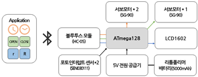
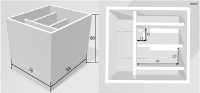
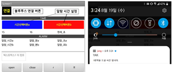
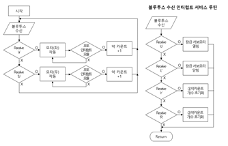

## 약상자

+ Abstract   
본 연구에서는 약 관리를 효율적으로 할 수 있는 스마트 약상자를 개발하였다. 약을 정기적으로 복용해야하는 사용자에 대해 약 복용을 관리할 수 있다. 이를 위해 3D 프린팅을 이용하여 외부 케이스를 제작하고 약을 보관하게 하였으며, 사용자의 복약 현황을 나타내주는 LCD가 전면에 있다. 제안하는 스마트 약상자를 이용하여 사용자의 복약을 효율적으로 관리할 수 있으며 복약 순응성을 높이고 약물의 오남용을 막을 수 있다. 

---------------------------
+ 서론   

---------------------------

+ 본론   
    + 전체 시스템 구성   
        + 전체적인 시스템 구성은 그림<1>과 같으며 AVR 기반의 ATmega128을 이용하여 제어한다. 또한 스마트폰 어플리케이션과의 블루투스 통신을 위해 블루투스 모듈(HC-05)을 사용한다. 하드웨어 제어를 위해 서보모터(SG-90)를 사용하였으며, Pulse Width Modulation(PWM) 제어 방식으로 –90° ~ 90° 까지 작동한다. 사용자의 약 복용 현황을 알려주기 위해 LCD를 사용한다. __약의 배출을 감지하기 위해 포토 인터럽터 센서 모듈(SEN030111)을 사용하며, 이 센서는 두 수광소자, 발광소자 사이에 물체가 존재하면 빛이 차단되고, 빛의 차단 유무로 물체의 존재를 판단하는 원리로 작동한다.__ 전원 공급을 위해 5V 충전 가능 전원 공급기(JBATT-U5-LC)와 리튬폴리머 배터리(5000mAh)를 사용한다0011.   
        

    + 약상자 외부 케이스    
        + 약상자의 케이스는 3D 프린터를 이용하여 제작하였다. 케이스 제작에 쓰인 3D 프린터는 Cubicon Single Plus 320C를 사용하였으며 3D 모델링 프로그램은 Autodesk의 TinkerCAD를 이용했다. <그림2>는 케이스의 3D 모델링을 보여준다. 케이스 크기는 76mm * 88mm * 80mm 이며 (기존에 나와있는 제품은 소분해서 넣어야하는데 이건..한알씩...)상단부는 약을 보관하는 공간이며 왼쪽칸과 오른쪽칸이 있으며 각 공간의 크기는 동일하고(41mm * 20mm) OO약을 기준으로 OO만큼 약 보관이 가능하다. 중단부는 약이 하단부로 통과하는 공간이 있으며 크기는 13mm * 15mm 이다. 이는 서보모터에 부착된 판으로 가려지는 부분이며 바로 아래에 포토 인터럽트 모듈이 위치한다. 마지막으로, 하단부는 약이 배출될 때 약을 보관할 서랍이 있으며, 서랍 잠금장치를 위한 서보모터가 있다. 이 서랍은 앞뒤로 꺼내고 넣을 수 있게 설계하였다.   
        
        
    + 약상자 시스템 어플리케이션   
        + 약상자 시스템에서 이용하기 위한 개발한 어플리케이션은 안드로이드 기반의 어플리케이션이며, __웹기반 안드로이드 앱 개발 플랫폼인__ MIT APP Inventor2를 이용하였다 [1]. 어플리케이션의 인터페이스는 <그림 4>와 같다. 케이스와의 통신을 위하여 블루투스 연결 버튼이 있으며 두 개의 약 보관 공간에 대해 알람 시간을 설정하는 버튼이 있다. 또한, 약상자 케이스의 서랍 잠금장치를 열고 잠그는 기능을 하는 ‘open’, ‘close’ 버튼이 어플리케이션 하단에 있다. 마지막으로, LCD에 표시한 각 약 복용 횟수를 초기화 할 수 있는 버튼 ‘r’, ‘R’이 있다. 사용자가 설정한 알람 시간이 되면 스마트폰 상단바에 알림이 울리며 사용자가 알 수 있도록 한다.   
        

    + 시스템 알고리즘   
        + 개발한 약상자 시스템은 ATmega128을 통해 제어 한다. 알고리즘의 순서도는 그림<4>와 같다. 약상자 케이스의 상단부에 약을 보관하며, 스마트폰 어플리케이션에서 설정한 시간이 되면 블루투스 USART 통신을 이용하여 MCU(ATmega128)(아니면 약상자)에 신호를 보낸다. 약상자가 어플리케이션으로부터 신호를 받으면 블루투스 수신 인터럽트 서비스 루틴을 이용하여 해당 신호에 맞는 동작을 실행한다.또한, 설정한 시간이 되었을 경우 서보모터가 작동하여 약을 배출한다. 서보모터는 PWM 제어를 통해 작동하며, Duty ratio에 비례하여 서보모터의 각도가 설정된다. 그러므로 Duty ratio를 천천히 증가시켜 모터를 작동시킨다. 서보모터에 부착된 판에 의해 가려진 통로를 열어 약을 떨어트리게 만든다. 이때, 약이 떨어진다면 하단에 있는 포토 인터럽트 모듈에 의해 감지가 된다. 그리고, 서보모터를 다시 반대 방향으로 작동시켜 통로를 막는 방법으로 구현하였다. (기존에 나와있는 제품은 소분해서 넣어야하는데 이건..한알씩...) 사용자가 각 약을 소비할 때마다 개수를 카운트해 얼마나 복용했는지 사용자가 알도록 하기 위하여 전면부에 부착된 LCD에 표시를 한다. 또한 10개 이상 복용하였을 경우 스마트폰 어플리케이션을 통해 알림을 보내 사용자가 인지하도록 하였다.   
        

    + 서보모터 작동 방식에 대한 실험 및 고찰   
        + 초기 연구에서 사용한 서보모터 제어 알고리즘은 기존과 다른 방법을 사용하였다. 초기의 방법은 PWM 제어라는 점은 동일하지만 서보모터를 천천히 Duty ratio를 증가시키는 것이 아닌 바로 90°의 각을 유지시키는 PWM 신호를 주는 것이었다. 이 방법은 약을 공급하는 과정에서 약을 하나씩 떨어트리는 비율이 낮기에 PWM을 천천히 증가시켜 구멍을 막는 판을 천천히 여는 방식을 이용하였다. 실제로 서보모터 제어를 변경하기 전 후에 대해 실험을 진행하였으며, 실험에 사용된 약은 OO약을 사용하였고 약과 비슷한 크기를 가진 BB탄(6mm)를 사용하여 실험을 진행하였다. 실험은 서보모터가 작동할 때 약이 하나씩 제대로 떨어지는 비율을 측정하였다. 실험 결과는 아래의 <표 1>과 같다.   
 <표 1> 서보모터 제어 방법과 약 실험 결과
(통과 가능한 약의 크기로 실험을 진행하였을 때 100번중 FF번 만큼 즉,CC% 확률로 약이 한알씩 떨어졌으며, 정확성은 앞으로 더 개선할 예정이다. )
실험 결과를 보면 OO약에 대해 서보모터 개선 전에 대해 AA% 개선된 결과를 보여주었고 BB탄(6mm)에 대한 결가는 BB% 개선된 결과를 보여주었다. 실험 결과로 알 수 있듯이 OOOOO한 점을 알 수 있다. 
통과 가능한 약의 크기로 실험을 진행하였을 때 100번중 00번 만큼 통과하였으며 00% 확률로 약이 한 알씩 떨어졌다는 것을 알 수 있다. 결과적으로, 00약에 대해 00% 개선된 결과를 보여주고, 000약에 대해선 00% 개선된 결과를 보여주었다. 정확성은 앞으로 더 개선해 나갈 예정이다. 

---------------------------

+ 결론   
본 논문에서는 꾸준히 규칙적으로 환자 및 사용자가 섭취해야 하는 약에 대해 관리할 수 있는 스마트 약상자를 개발하였다. 이 시스템을 통하여 규칙적으로 복용이 필요한 약들을 관리할 수 있는 측면에서 장점이 있다. 블루투스 어플리케이션을 통해 약상자와 연동을 하여 사용자가 지정한 시간에 맞게 약을 공급받을 수 있다. 이러한 시스템으로 사용자의 복약 순응도를 높이며, 약의 오남용을 방지할 수 있다. 향후 과제로는 현재보다 더 원활한 알약 공급을 위해 연구를 진행하며 보다 더 많은 약의 종류를 보관할 수 있는 방법을 고려해야한다.   

+ 참고문헌   
[1] ...

